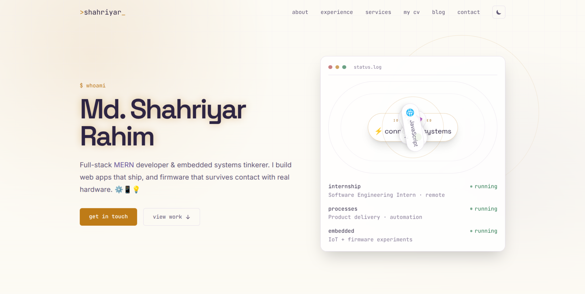
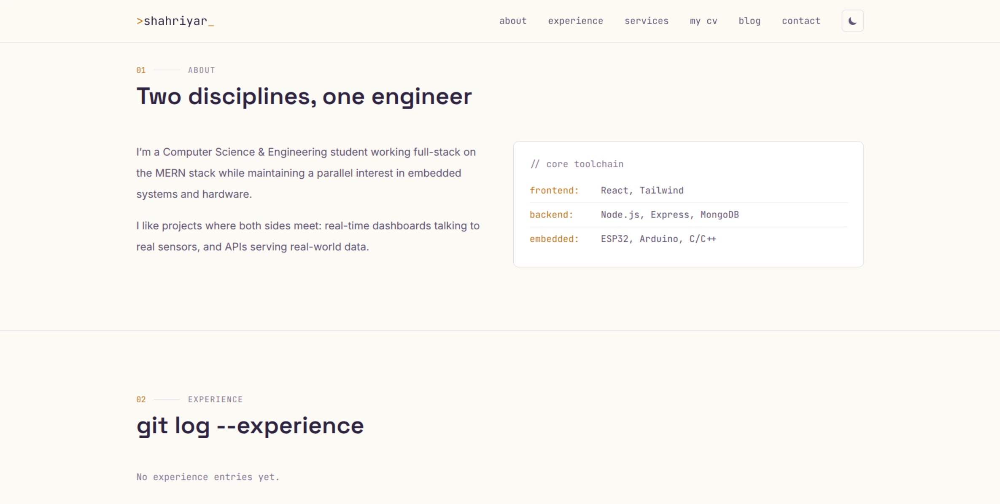
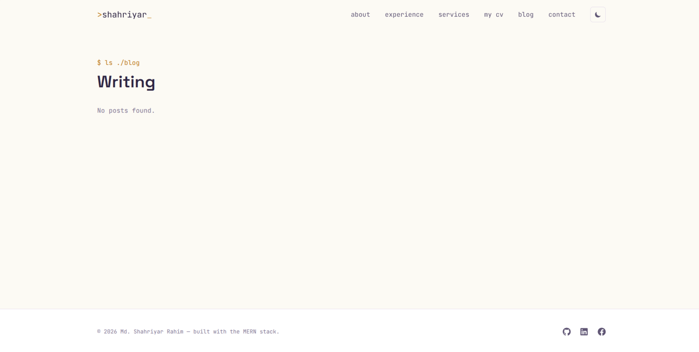
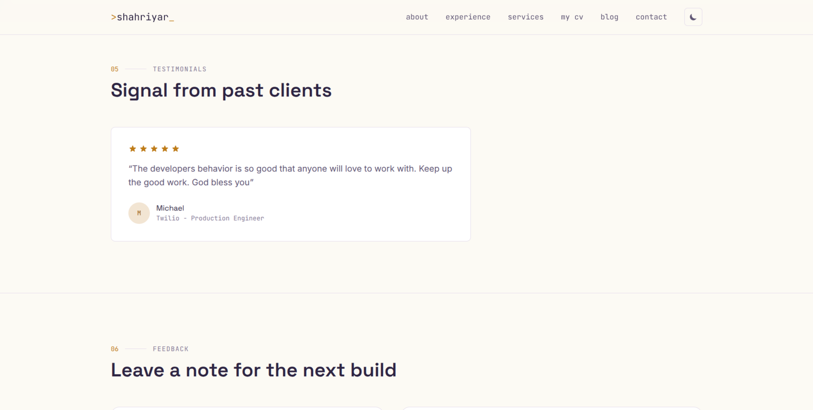
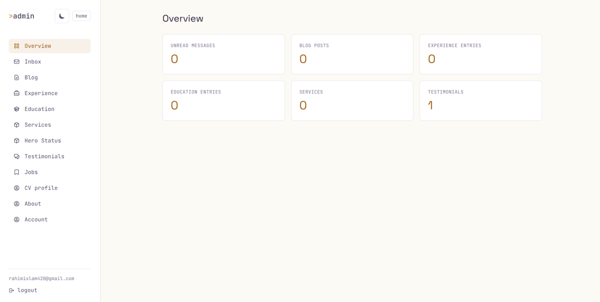
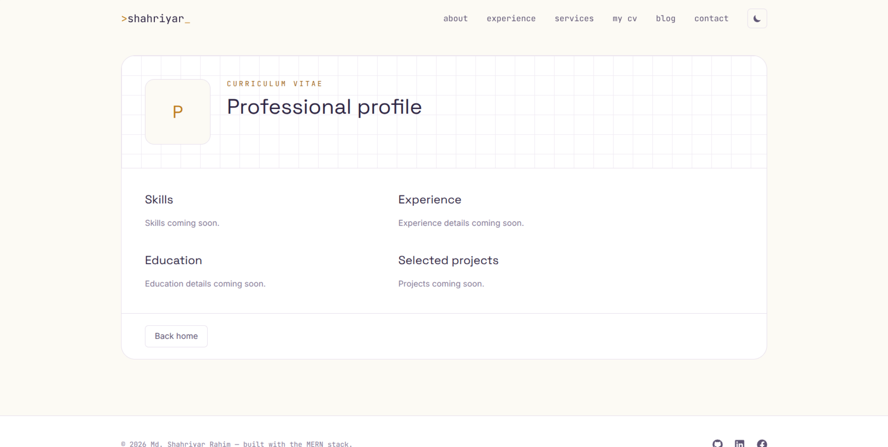

<div align="center">

# &gt;shahriyar_

### Full-Stack MERN Developer &amp; Embedded Systems Engineer — Personal Portfolio

A self-built, self-hosted portfolio platform — not a template. Every section (hero, experience,
education, services, blog, testimonials, job board, CV/profile) is content-managed from a
custom admin panel, backed by a REST API I designed and wired up myself.

[](#-live-demo)


</div>

---

```
$ whoami
> Md. Shahriyar Rahim — BSc CSE @ BAUST · MERN developer · AI/ML . BIOINFORMATICS
```

## 🔗 Live Demo

| | |
|---|---|
| **Website** | [[https://shahriyar.no-idea.top/](https://shahriyar.no-idea.top/)] &nbsp;·&nbsp;  |
| **API** | `(https://portfolio-delta-smoky-24.vercel.app/api/v1` &nbsp;·&nbsp; |
| **Admin panel** | `/login` on the site above (credentials are private — see [Admin access](#-admin-access)) |

> Not deployed yet? See [Deployment](#-deployment) below for the quickest path with Vercel + Render/Railway + MongoDB Atlas.

---

## 🖼️ Screenshots

<div align="center">

| Homepage — Hero | Experience &amp; Timeline |
|---|---|
|  |  |

| Blog | Testimonials |
|---|---|
|  |  |

| Admin Dashboard | CV / Profile Page |
|---|---|
|  |  |

</div>

> 📸 Images above are placeholders. Run the app locally (or visit the live demo), capture screenshots
> at ~1280px wide, and drop them into `docs/screenshots/` using the exact filenames referenced above —
> they'll render automatically here. See [`docs/screenshots/README.md`](./docs/screenshots/README.md)
> for the full shot list and naming convention.

---

## ✨ Features

**Public site**
- Terminal/circuit-board visual identity — copper-trace + oscilloscope-blue accents, `status.log`-style
  hero panel, monospace utility labels throughout
- Dynamic hero content, experience, education, services, and testimonials — all editable from the
  admin panel, none of it hardcoded
- Blog with categories and a comment thread per post
- Testimonial submission with up to 3 photo uploads, star ratings, and a dedicated detail page
- Auto-scrolling "Recent Work" strip pulling live from the GitHub API, plus a full `/projects` grid
- Job board section with role/skill/type filtering
- Auto-generated **CV / profile page** — upload a PDF résumé once, the backend parses it, and a
  public profile page renders from the extracted data
- Contact form with rate-limiting, spam-window protection, and branded HTML email replies

**Admin panel** (`/login` → `/admin`)
- Full CRUD for experience, education, services, blog posts, hero content, and job listings
- Testimonial moderation — approve/unapprove, edit, delete
- Inbox — read/reply to contact form submissions from inside the dashboard
- Account settings — change email, change password
- Secure recovery flow — forgot-password via emailed magic link, plus a two-step
  alphanumeric verification code as a second path
- One-time setup script (`scripts/create-admin.js`) to bootstrap the first admin account —
  no open public registration endpoint

**Engineering**
- Single-owner auth model (JWT in an httpOnly cookie) — no unnecessary multi-user complexity
- Cloudinary + multer image pipeline for every upload (blog covers, service images, testimonial
  photos, CV PDFs)
- Centralized, templated HTML email system (Nodemailer) shared by contact + testimonial + auth flows
- React Query for all server state, Zustand for the thin client-side auth flag, react-hook-form +
  Framer Motion throughout

---

## 🧱 Tech Stack

| Layer | Stack |
|---|---|
| **Frontend** | React 19, Vite, React Router 8, Tailwind CSS v4 + daisyUI, TanStack Query, Zustand, React Hook Form, Framer Motion, Axios, React Icons, React Hot Toast |
| **Backend** | Node.js, Express 5, MongoDB + Mongoose 9, JWT, bcrypt, Multer + Cloudinary, Nodemailer, pdf-parse, express-rate-limit |
| **Infra / tooling** | ESLint (flat config), ESM throughout, cookie-based auth, GitHub REST API integration |

---

## 📁 Repository Structure

This is a two-service monorepo — a Vite/React SPA and a standalone Express API — deployed and run
independently.

```
.
├── backend/
│   ├── scripts/
│   │   └── create-admin.js            # one-time admin bootstrap (run once, then remove/rotate SETUP_KEY)
│   ├── src/
│   │   ├── configs/
│   │   │   ├── auth.config.js         # JWT sign/verify helpers
│   │   │   ├── cloudinary.config.js   # Cloudinary SDK setup
│   │   │   ├── database.config.js     # Mongoose connection
│   │   │   ├── email.config.js        # HTML email templates (header/body/CTA/footer)
│   │   │   ├── mailer.config.js       # shared Nodemailer transporter + sendMailSafe()
│   │   │   └── multer.config.js       # CloudinaryStorage upload middleware
│   │   ├── controllers/
│   │   │   ├── authRecovery.controller.js   # forgot-password (magic link + 2-step code)
│   │   │   ├── blog.controller.js
│   │   │   ├── commnet.controller.js        # blog comments
│   │   │   ├── cv.controller.js             # CV upload, parsing, profile generation
│   │   │   ├── education.controller.js
│   │   │   ├── experience.controller.js
│   │   │   ├── file.controller.js           # generic admin file manager
│   │   │   ├── github.controller.js         # server-side GitHub API proxy (auth'd, cached)
│   │   │   ├── heroStatus.controller.js     # dynamic hero "status.log" entries
│   │   │   ├── inbox.conroller.js           # contact form + admin replies
│   │   │   ├── job.controller.js            # job board CRUD + filtering
│   │   │   ├── service.controller.js
│   │   │   ├── testimonial.controller.js    # submissions, moderation, images
│   │   │   └── user.controller.js           # login/logout/me/account settings
│   │   ├── middlewares/
│   │   │   ├── protect.js             # JWT auth guard (cookie or Bearer)
│   │   │   └── rateLimiter.js         # auth + contact-form rate limits
│   │   ├── models/
│   │   │   ├── blog.model.js
│   │   │   ├── comment.model.js
│   │   │   ├── cvProfile.model.js
│   │   │   ├── education.model.js
│   │   │   ├── experience.model.js
│   │   │   ├── file.model.js
│   │   │   ├── heroStatus.model.js
│   │   │   ├── inbox.model.js
│   │   │   ├── job.model.js
│   │   │   ├── service.model.js
│   │   │   ├── testimonial.model.js
│   │   │   └── user.model.js
│   │   ├── routes/                    # one router per resource, mirrors controllers/
│   │   └── server.js                  # app bootstrap, middleware, route mounting
│   ├── .env.example
│   ├── package.json
│   └── package-lock.json
│
├── frontend/
│   ├── public/
│   ├── src/
│   │   ├── components/
│   │   │   ├── admin/                 # Modal, FieldInput, ResourceList — shared admin CRUD kit
│   │   │   ├── About.jsx / Hero.jsx / Navbar.jsx / Footer.jsx
│   │   │   ├── ExperienceTimeline.jsx / EducationTimeline.jsx / ServicesGrid.jsx
│   │   │   ├── BlogCard.jsx / BlogPreview.jsx
│   │   │   ├── TestimonialForm.jsx / TestimonialSlider.jsx
│   │   │   ├── JobBoard.jsx / RecentWorks.jsx / TechOrbit.jsx
│   │   │   ├── ThankYouModal.jsx / RevealOnScroll.jsx / SectionHeading.jsx
│   │   │   └── Loader.jsx / ErrorNotice.jsx
│   │   ├── layouts/
│   │   │   ├── MainLayout.jsx         # public site shell (Navbar + Footer)
│   │   │   └── AdminLayout.jsx        # admin dashboard shell (sidebar nav)
│   │   ├── lib/
│   │   │   ├── api/                   # one axios module per resource
│   │   │   ├── hooks/                 # TanStack Query hooks (generic CRUD factory + per-domain)
│   │   │   ├── helper/                # formatting, FormData utilities
│   │   │   └── stores/                # Zustand auth store
│   │   ├── pages/
│   │   │   ├── Home.jsx / BlogList.jsx / BlogDetail.jsx
│   │   │   ├── TestimonialsPage.jsx / WorkDetailPage.jsx / CvProfilePage.jsx
│   │   │   ├── Login.jsx / NotFound.jsx
│   │   │   └── admin/                 # Dashboard, Inbox, Blogs, Experience, Education,
│   │   │                               # Services, Testimonials, Jobs, HeroStatus, Account
│   │   ├── routes/
│   │   │   ├── router.jsx             # route table
│   │   │   └── ProtectedRoute.jsx     # admin auth guard
│   │   ├── App.jsx
│   │   ├── main.jsx
│   │   └── index.css                  # design tokens (colors/fonts) + Tailwind layer
│   ├── .env.example
│   ├── index.html
│   ├── package.json
│   └── vite.config.js
│
├── docs/
│   └── screenshots/                   # drop your screenshots here (see naming guide inside)
└── README.md                          # you are here
```

---

## 🚀 Getting Started

### 1. Backend

```bash
cd backend
npm install
cp .env.example .env   # fill in MongoDB, JWT, Cloudinary, email, and GitHub token values
npm run dev
```

Create your admin account once, using the bootstrap script (no public registration endpoint exists):

```bash
node scripts/create-admin.js
```

### 2. Frontend

```bash
cd frontend
npm install
cp .env.example .env   # set VITE_API_URL and VITE_GITHUB_USERNAME
npm run dev
```

Visit `http://localhost:5173`. The admin dashboard lives at `/admin`, behind `/login`.

### 3. Build for production

```bash
cd frontend && npm run build     # outputs frontend/dist
cd backend  && npm start         # or your process manager of choice (pm2, systemd, etc.)
```

---

## 🌐 Deployment

| Piece | Suggested host |
|---|---|
| Frontend (`frontend/dist`) | Vercel / Netlify |
| Backend (`backend/`) | Render / Railway / Fly.io |
| Database | MongoDB Atlas (free tier is enough) |
| Images | Cloudinary (already wired in) |

After deploying, come back and fill in the [Live Demo](#-live-demo) table above with your real URLs.

---

## 🔐 Admin Access

There is intentionally no public sign-up — this is a single-owner site. Bootstrap your one admin
account locally with `backend/scripts/create-admin.js`, then log in at `/login`. Forgot-password is
handled via an emailed magic link or a two-step alphanumeric code (`authRecovery.controller.js`) —
no admin credentials are ever stored in this repo or its history.

---

## 📄 License

MIT — see [`LICENSE`](./LICENSE) if included, or treat this repository as personal/portfolio code
you're free to reference but not redistribute as-is under someone else's name.

---

<div align="center">

Built by **Md. Shahriyar Rahim** — [GitHub](https://github.com/Shahriyar-Rahim) · portfolio at the live link above.

</div>
